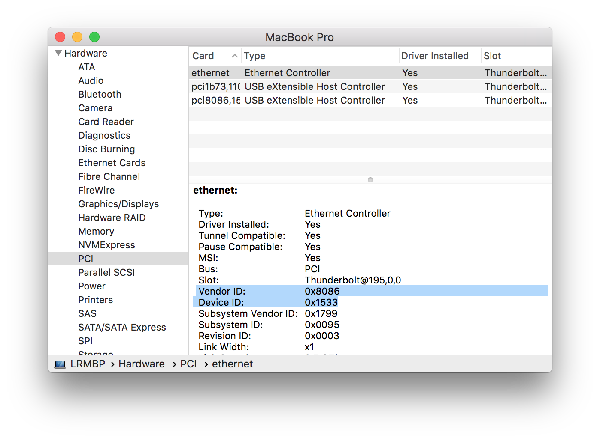

[](https://github.com/himbeles/mac-device-connect-daemon/actions?query=workflow%3A%22Compile+Handler%22)

# Run shell script or executable triggered by device detection on a Mac

This tutorial describes how to run an arbitrary executable or shell script triggered by the connection of an external device (usb/thunderbolt) to a Mac.

This relies on Apple's `IOKit` library for device detection and a daemon for running the desired executable.
See BSD man page on `xpc_events`:
```sh
man xpc_events
```

For the daemon to not be triggered repeatedly after connecting the device, a special stream handler (created by [Ford Parsons](https://github.com/snosrap/xpc_set_event_stream_handler/blob/master/xpc_set_event_stream_handler/main.m)) is used to "consume" the `com.apple.iokit.matching` event, as explained [here](https://github.com/snosrap/xpc_set_event_stream_handler).

For example, this can be used to spoof the MAC address of an ethernet adapter when it is connected to the Mac.
The setup is explained using the MAC spoofing scenario example files in `example-spoof-MAC` but can be generalized to arbitrary executables and devices.


## Put your shell script or executable into place

Adapt the shell script `spoofmac.sh` to your needs and
make it executable:

```
sudo chmod 755 spoofmac.sh
```

Then move it into `/usr/local/bin`, or some other directory:

```
cp spoofmac.sh /usr/local/bin/
```

## Building the stream handler

The stream handler is universal (no need to adapt) and can be built on a Mac (with xcode installed):

```
gcc -framework Foundation -o xpc_set_event_stream_handler xpc_set_event_stream_handler.m
```

Let's place it into `/usr/local/bin`, like the main executable for the daemon.

```
cp xpc_set_event_stream_handler /usr/local/bin/
```

The stream handler is also compiled via a [Github Action](https://github.com/himbeles/mac-device-connect-daemon/actions?query=workflow%3A%22Compile+Handler%22) on every commit. 
This uses a Github `macos-latest` machine. 


## Setup the daemon

The plist file `com.spoofmac.plist` contains the properties of the daemon that will run the executable on device connect trigger.

It contains information for identifying the device you want to base your trigger on, like `idVendor`, `idProduct`, `IOProviderClass`. 
Get them via the output of
```sh
ioreg -p IOProviderClass -l
```
where `<IOProviderClass>` should be either `IOPCI` (Thunderbolt) or `IOUSB` (USB).

The identifiers can also be obtained from the `System Information` App on your Mac.



Convert the hex identifiers to integers before inserting into the plist file (for example using `int(0x8086)` in python).

`IOProviderClass` should be either `IOPCIDevice` (Thunderbolt) or `IOUSBDevice` (USB).

The other relevant entry in the plist file is the location of `xpc_set_event_stream_handler` and the executable.

Other entries include the location of standard output (log) files and the executing user.


Since MAC spoofing requires root privileges, we put `com.spoofmac.plist` into `/Library/LaunchDaemons`:

```
cp com.spoofmac.plist /Library/LaunchDaemons/
```

not into a `LaunchAgents` folder. Launch agents ignore the `UserName` argument.

Insure that the owner of the file is `root`:

```
sudo chown root:wheel /Library/LaunchDaemons/com.spoofmac.plist
```

## Launch the daemon

Activate the daemon:

```
launchctl load /Library/LaunchDaemons/com.spoofmac.plist
```

and you are good to go.


Unloading is done using `launchctl unload`.

## Support me
If you like this tutorial and code and you would like to support me,

<a href="https://www.buymeacoffee.com/lri" target="_blank"></a>
